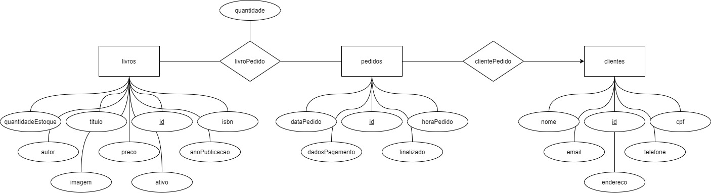

# Livraria Virtual
Sistema de controle de pedidos de uma livraria.


## Requisitos para rodar

- Phythos 3
- Docker


## Montando ambiente

* Rodar o mariadb
```
 docker run -p 127.0.0.1:3306:3306 --name mariadb --restart unless-stopped -e MARIADB_ROOT_PASSWORD=SENH4 -d mariadb:latest
```

* Criar o banco de dados ([livrariaVirtual.sql](database/livrariaVirtual.sql))

* Instalar as dependências
```
pip3 install mariadb SQLAlchemy Flask requests
```

* Rodar o serviço do backend (apenas para Windows, para outro sistema operaciona [clique aqui](https://flask.palletsprojects.com/en/2.0.x/quickstart/#a-minimal-application))
```
server\run.bat
```

* Rodar  o serviço do frontend (apenas para Windows, para outro sistema operaciona [clique aqui](https://flask.palletsprojects.com/en/2.0.x/quickstart/#a-minimal-application))
```
frontend\run.bat
```


## Rotas do backend

### De clientes
- \<UrlApi\>/cliente

Rota _POST_ que espera um requet json no seguinte formato:
``` json
{
	"cpf": "12345678901",
	"nome": "nome do cliente"
}
```

- \<UrlApi\>/cliente/\<cpf\>

Rota _GET_ com response json no seguinte formato:
``` json
{
	"cpf": "12345678901",
	"id": 1,
	"nome": "nome do cliente"
}
```

### De livros
- \<UrlApi\>/livro

Rota _POST_ que espera um requet json no seguinte formato:
``` json
{
  "anoPublicacao": 2021,
  "autor": "autor autor",
  "estoque": 1,
  "isbn": "12345",
  "preco": 1.11,
  "titulo": "titulo do livro"
}
```
Com response json no seguinte formato:
``` json
{
  "anoPublicacao": 2021,
  "autor": "autor autor",
  "estoque": 1,
  "id": 1,
  "isbn": "12345",
  "preco": 1.11,
  "titulo": "titulo do livro"
}
```

- \<UrlApi\>/livro

Rota _GET_ com response json no seguinte formato:
``` json
[
  {
    "anoPublicacao": 2021,
    "autor": "nome do autor",
    "id": 1,
    "isbn": "1234567890123",
    "preco":  1.11,
    "titulo": "titulo do livro 1"
  },
  {
    "anoPublicacao": 2021,
    "autor": "nome do autor",
    "id": 2,
    "isbn": "1234567890123",
    "preco": 1.11,
    "titulo": "titulo do livro 2"
  }
]
```

- \<UrlApi\>/livro/maisVendidos

Rota _GET_ com response json no seguinte formato:
``` json
[
  {
    "autor": "nome do autor",
    "quantidade": 10,
    "titulo": "titulo do livro mais vendido"
  },
  {
    "autor": "nome do autor",
    "quantidade": 8,
    "titulo": "titulo do segundo livro mais vendido"
  }
]
```

- \<UrlApi\>/livro/\<idLivro\>

Rota _GET_ com response json no seguinte formato:
``` json
{
  "autor": "nome do autor",
  "estoque": 1,
  "id": 1,
  "preco": 1.11,
  "titulo": "titulo do livro"
}
```

### De pedidos
- \<UrlApi\>/pedido

Rota _POST_ com response json no seguinte formato:
``` json
{
  "dataPedido": "Wed, 23 Jun 2021 00:42:34 GMT",
  "id": 1
}
```

- \<UrlApi\>/pedido/\<idPedido\>/add/\<idLivro\>

Rota _POST_ 

- \<UrlApi\>/pedido/\<idPedido\>/rem/\<idLivro\>

Rota _POST_ 

- \<UrlApi\>/pedido/\<idPedido\>/cli/\<cpf\>

Rota _POST_ 

- \<UrlApi\>/pedido/\<idPedido\>/finalizar

Rota _POST_ 

- \<UrlApi\>/pedido

Rota _GET_ com response json no seguinte formato:
``` json
[
  {
    "dataPedido": "Wed, 16 Jun 2021 22:18:05 GMT",
    "id": 1
  },
  {
    "dataPedido": "Wed, 16 Jun 2021 22:18:06 GMT",
    "id": 2
  },
  {
    "dataPedido": "Wed, 16 Jun 2021 22:18:18 GMT",
    "id": 3
  }
]
```

- \<UrlApi\>/pedido/finalizados

Rota _GET_ com response json no seguinte formato:
``` json
[
  {
    "dataPedido": "Wed, 16 Jun 2021 22:18:05 GMT",
    "id": 1
  },
  {
    "dataPedido": "Wed, 16 Jun 2021 22:18:06 GMT",
    "id": 2
  },
  {
    "dataPedido": "Wed, 16 Jun 2021 22:18:18 GMT",
    "id": 3
  }
]
```

- \<UrlApi\>/pedido/\<idPedido\>

Rota _GET_ com response json no seguinte formato:
``` json
{
  "cliente": {
    "nome": "nome do cliente"
  },
  "dataPedido": "Wed, 16 Jun 2021 22:18:05 GMT",
  "finalizado": true,
  "id": 1,
  "livros": [
    {
      "id": 1,
      "preco": 1.11,
      "quantidade": 1,
      "titulo": "titulo do livro"
    }
  ]
}
```


## Modelo de entidade relacionamento

